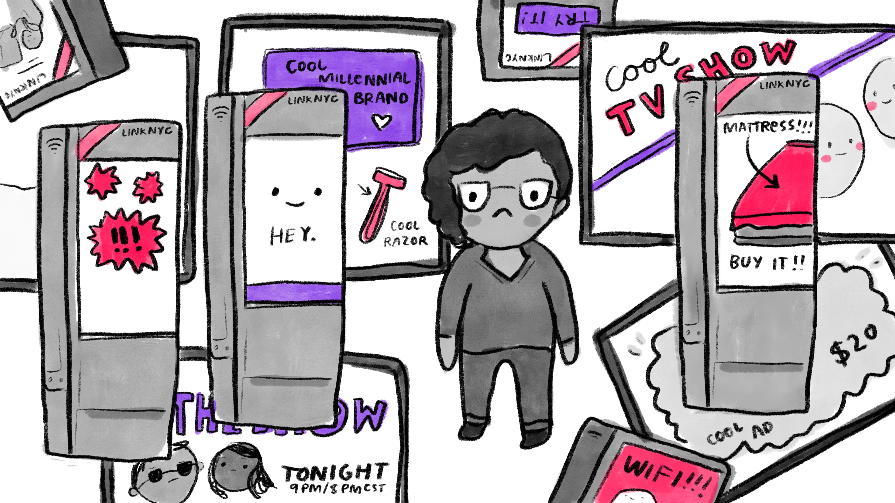
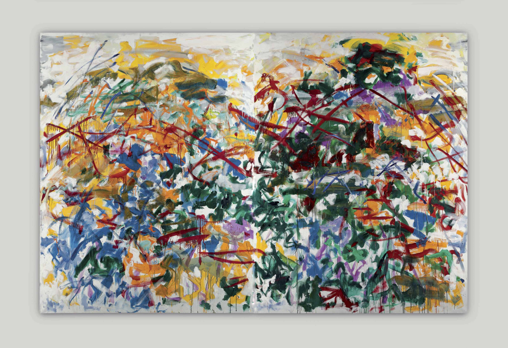
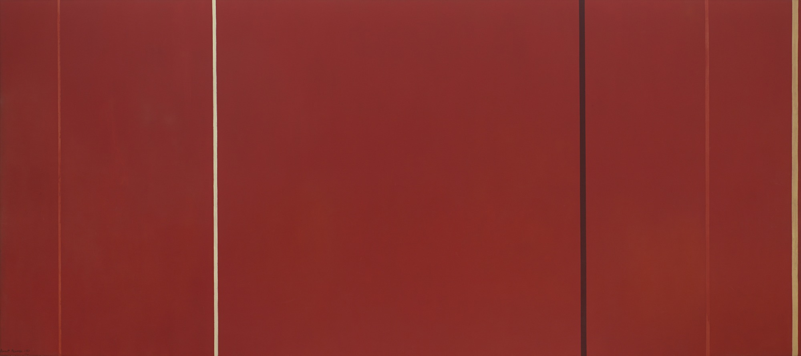
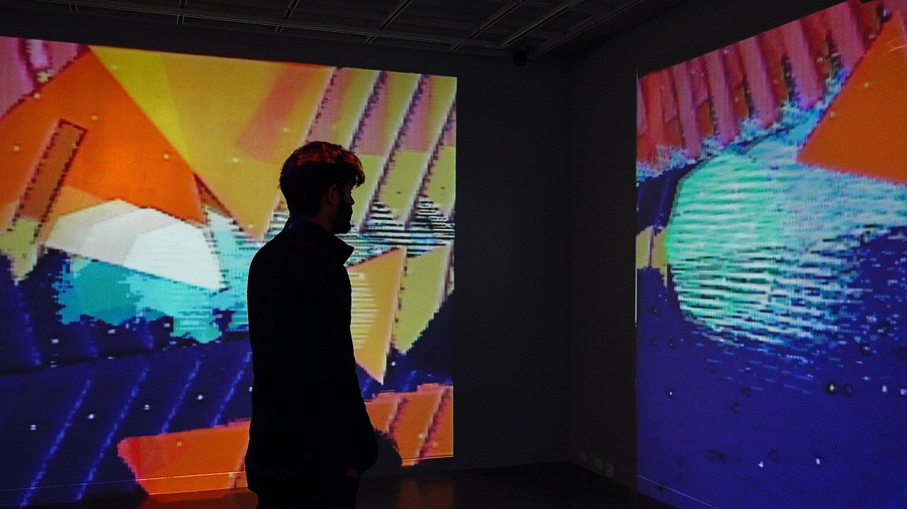
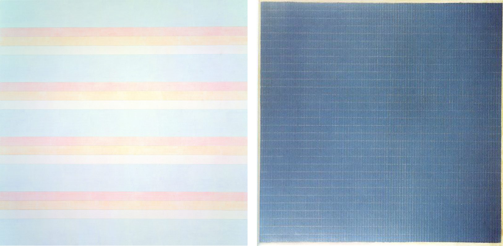
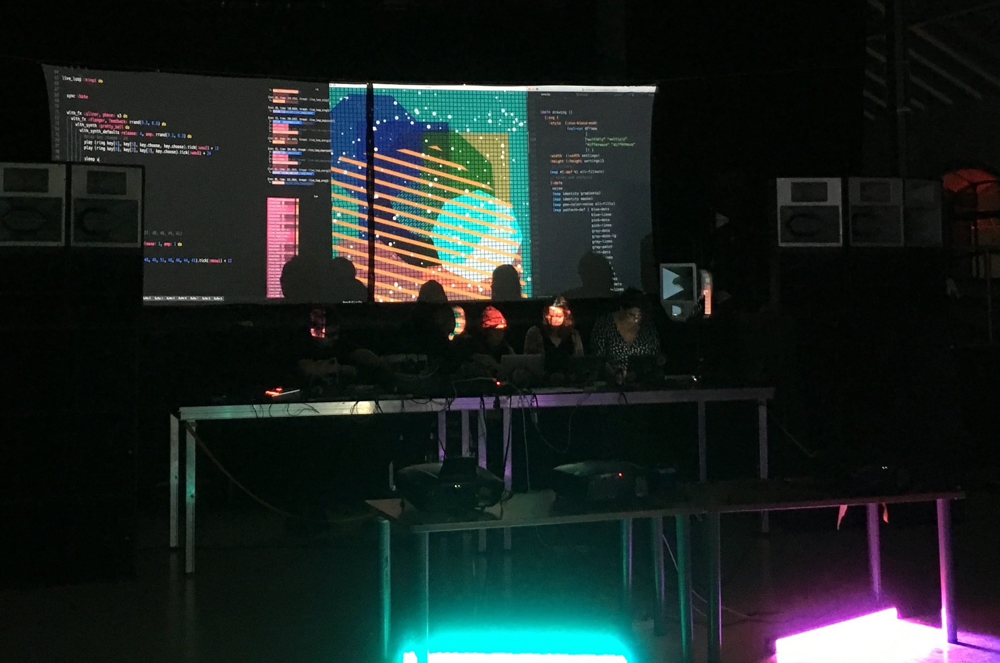
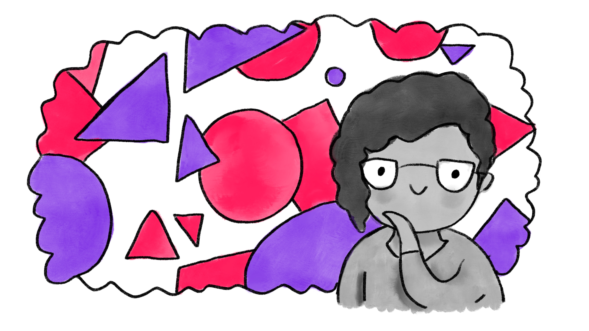

# Computer Critical Computer Art

---

##### This essay was inspired by *Undermining Computing*, [my 2019 Eyeo talk](https://vimeo.com/354276927). It has been edited and the second part refocused. If you’re here just for the art and not the AI rant, feel free to skip to the [second part](#materialism_and_transcendence).

---

## Computers are the enemy ... 
Third Avenue between 14th and 24th Streets is an unremarkable stretch of Manhattan. The street is lined with white whale apartment buildings, with the shells of that species of disappearing diner for which Forgotten New York grieves. There are bodegas, an Irish bar, a Duane Reade, a decent bagel shop. For nearly fifteen years, I have walked these ten blocks from the L train to the Baruch swimming pool at least twice a week. Other than a stretch of SoHo where I’ve had three different jobs, there is no part of Manhattan I know quite so well.

The vista up the avenue, with tall buildings leaning away from one another while the arc of the road rises between them like a New Yorker cover, can fill me with that vertiginous joy that always surfaces when I can see history — my own, all of ours — welling up over itself in one spot. I can stand and see the avenue in every season and year; see it when the diners were still unrenovated; see it on muggy summer mornings when I wore short-shorts and dodged bad decisions from the night before; see it covered in snow, with a pale dawn on the horizon and me puffing along in two sweaters, using my headphones as earmuffs.s

All of which is to say, these unremarkable blocks are very dear to me: foundational. And now, they have been ruined: first slowly and then all at once. Now, when I walk to swim practice, I pass 21 LinkNYC kiosks, monoliths to all our bad tech decisions in one small place. Their screens, overbright and infected with moving advertisements, complicate quiet enjoyment. Their sensors can sniff my phone’s unique identifiers and their three cameras can track me going along, weaving in and out of slow walkers when the street is crowded, dawdling when it is empty.

These kiosks are animated by former NYC deputy mayor and Sidewalk Labs Chairman and CEO Dan Doctroff’s nightmare dream, as reported by [Gothamist](https://gothamist.com/2019/04/22/linknyc_smash.php),

>  to track pedestrians and serve them targeted ads, with the goal of **“replicating” the digital experience in physical space**.

At first this sounds only garden-variety stupid, a proposition to add terrible popups and ads for air-conditioners the day after you buy one to real life, like any dystopian film intro. 

But with “the digital experience” being more and more allied with being surveilled, exploited, and reduced to a statistic, the dream becomes far more sinister. It becomes the crisis of surveillance capitalism sharpening around us day by day — almost to the point of an awl. The amorphous threat of the authoritarian net hovering just over there.

The easiest jump to over there can seem to be literally over there, to China, where the authoritarian uses of surveillance are overt. There is the growing social credit system in which doing government-defined “bad things” like playing video games for too long, wasting money on frivolous purchases, posting on social media, or loitering outside the boarding gate at the airport can be sanctioned by travel restrictions, higher interest rates on loans, internet throttling, and blacklisting from schools for the offender and her family. This approach reaches its repressive apotheosis in Xinjiang, where ethnic minority Muslim citizens are surveilled via their ID cards, vehicles, electric meters, and smart phones (or placed on lists for not using a smart phones). If citizens are out of the country for “too long,” police are told to interrogate relatives and friends. If someone who does not own a car fuels it up, police are alerted. Up to a million have already been interned in re-education camps. (I can’t do justice to this crisis in an art essay, but [the Believer](https://believermag.com/weather-reports-voices-from-xinjiang/) sure has.)

While technologies are packaged and presented differently in China and in the US, the daily manifestations are in many ways the same: streets are covered in cameras; messages from those in power follow us from screen to screen; our social media and communications are subject to being vetted whenever we cross a border. 

Outside of state power, social media, advertising, and communications companies track our locations and attentions whenever they can. And all of this data is recorded so that these organizations can continue finding new ways to exploit it in the future. As Human Rights Watch points out in the case of China — it’s not just the governments circumscribing liberty and keeping watch; it’s the private companies that support them. As the current pandemic proceeds, the two grow closer and closer throughout the West as well.

In the US, academics and private companies have shown themselves to be untrustworthy — willing to use any dataset they can get, regardless of how it was originally procured, and willing to offer datasets to bad actors, regardless of the innocence in which they were originally collected. 

Facial recognition systems are trained on datasets that include clips recorded by CCTV cameras in the 90s and webcams from San Francisco coffee shops. (I escaped this dataset by quitting my job around the corner from the place just months before the data collection began. I am certain to populate others.)

[Roomba saves maps to your home.](https://www.theverge.com/circuitbreaker/2018/9/6/17817220/irobot-roomba-i7-robot-vacuum-empties-itself-maps-house) While they currently say they will only share with third-parties users approve, there is a hard push towards home assistants on that list. So while insulating themselves, they are happy to help you provide your data to companies with fewer scruples. 

Companies like Amazon, where workers for [Alexa listen to customers’ private conversation](https://www.independent.co.uk/life-style/gadgets-and-tech/news/amazon-alexa-echo-listening-spy-security-a8865056.html) — ostensibly to parse recordings and provide this data to “improve” the device. They also just happen to do it through private background noise and to share “exciting” clips with one another on chat rooms. This of course mixes two problematic aspects of the current situation — lack of privacy _and_ exploitation of low-wage workers dressed up as “machine intelligence”. The latter is also the case with Kiwibots — originally presented as food delivery “robots,” who turn out to be [piloted by Colombians making less than $2 an hour](https://www.sfchronicle.com/business/article/Kiwibots-win-fans-at-UC-Berkeley-as-they-deliver-13895867.php?psid=8Egbh#photo-17543383). 

Where decisions _are_ becoming fully automated is in civil governments, where algorithmic systems are being used in big decisions — [like parole eligibilty, school assignments, child protection investigations and public benefits eligibility](https://ainowinstitute.org/nycadschart.pdf). You know, just the places where we should be using methods known to reify current inequalities and to do so in a way that shields the results from being interrogated.

That most machine learning models are merely amplifications of reified biases can be seen in the fact that [research has shown it is is possible to reverse engineer sensitive data from the models themselves](https://arxiv.org/abs/1802.08232)— the data is [burned in](https://mobile.twitter.com/JoeBeOne/status/1238585103208656899). That all data is biased — that it contains a point of view — is brilliantly elucidated in [this piece from artist and data scientist Hannah Davis](https://towardsdatascience.com/a-dataset-is-a-worldview-5328216dd44d). Davis suggests poorly —carelessly or mendaciously — done “classification is violence.” I would suggest this characterizes anything but the broadest labelling. 

Altogether, the flower of the Information Age is turning out to be a *Titan arum*, a corpse flower.

##  ... and artists are giving them cover 
### (Stop making AI art)

Meanwhile, the art world seems dedicated to art-washing these technologies. In this trade-off the finest purveyors of surveillance and classification technology get [the legitimating and popularizing function of artists on their side](https://medium.com/artists-and-machine-intelligence/q-a-with-reena-jana-e3ee5dec984e). Artists, in turn, are able to satisfy the siren call of relevance and our own self-approbation as an avant-garde.

The result is a stack of fake paintings of generic white men and smeared-looking PNGs, all generated by some combination of GANs and classifiers.

These are characteristic of the _aesthetic of the probable_, a visual indeterminacy that is the natural outcome of a system that works by determining what is statistically probable and calling it good enough. It lacks edge, decision, definitiveness and integrity, and valorizes these as “uncanniness” or the sign the computer is “learning”. The aesthetic of the probable is also an aesthetic of sifting, picking the happy accidents out of a pile of the less-fortunate. 

  <video class="essay-video-double" src='https://sarahghp.com/vids/dark-n-smeary-02' autoplay loop></video>
  <video class="essay-video-double" src='https://sarahghp.com/vids/dark-n-smeary-01' autoplay loop></video>

 

It has its sonic echo in popular music’s mushy “spotify sound” and its moral echo in the lack of integrity that is required for a continual belief that AI exists, works, and should be deployed as a sign of progress. It is a game of finding the offcuts within the classified, implying that these are unusual and grotesque because they almost fit.

While a few truly critical projects emerge — highlighting the unsettling nature of surveillance and extrapolation technologies — the rest support narratives that encourage people to hand decisions over to machines, highlighting the computer’s role as partner or even independent thought machine. 

These are accompanied by other conceptual concerns around AI art — from critical works that imply using a system and discovering the contradictions and opposition in its output is sufficient to the climate impact of intensive model training and work generation to those projects that put a friendly gloss on facial recognition, allowing it to seem “not all bad”.

The validity of classification itself is rarely questioned.

<h2 id="materialism_and_transcendence">Materialism and Transcendence</h2>

### (Abstract Expressionism Is Relevant Again)

And so, this is the fundamental violence of the AI/ML machine: its insistence that we are not individuals but a type — that we are not all independent, valuable souls, but just a probability. The illusion of information is that it can know us by capturing all the externalities: where we are, who we are with, where we were born, where we fit within sociological categories — and its destruction is that because it can never capture the internal, it substitutes these externalities and claims that they can describe us in a meaningful way.

Given the way this violence echoes the violence of the Second World War, the first computerized war — from category-based genocide to punchcards at Harvard for the Pentagon and cybernetics-inspiring artillery correction — we could do worse than looking to the responses of the abstract expressionists, those unfashionable modernists. We could counter this impersonalism with something personal — something reliable for being individual, something not subject to the delusions of the group or reminiscent of mechanized — digitized — destruction. Pieces that assert their object-ness, and insist on being in the world.

In classic art-historical style, these works might issue from advances in technology without subsuming themselves. In the same way tubed, synthetic paints made possible impressionism and engagement with acrylic paints is fundamental to abstract expressionism, the goal is not to turn away from technical innovations, but to harness them to art. Where we have failed so far is by infecting art with innovation instead of innovation with art. (Early generations did have it somewhat easier as acrylics were not directly enabling misery and genocide.)

But what does it mean to reengage with the abstract expressionist tradition? It is to reengage with materiality and to concern ourself with a transcendence fixed in mind-to-mind, over-air communication.

I think of Joan Mitchell and Ethel Schwabacher. I think of the Agnes Martin room at SFMOMA and Martins encountered elsewhere. I think of Barnett Newman’s color fields, especially _Vir Heroicus Sublimis_.

  

When I encounter these works today, and I hope it is the same for you, I feel that same vast filar connection I get from Third Avenue or from reading Proust: a sense of my own multipartite consciousness, suspended and resonant, a bit lonely and nearly mystical — essentially the sublime.

To create works in pursuit of this feeling is an fundamentally romantic undertaking — which is to say, currently unfashionable — but I don’t know it to be any more romantic at core than the idea that what makes art important is its position on the “cutting edge.” And besides, despite teledildonics, computers have yet to romance anyone but VCs.

As with all budding romances, setting is key. Working backwards from my own superlative experiences of art — the Martin room, _Women of Abstract Expressionism_ at the Denver Art Museum, Fred Sandbeck at Dia Beacon, Aldo Tambellini at the Tate, my own tests at the Immersion Gallery at Alfred University — I know the space must optimize for the individual encounter. It should be as vast as possible and quiet. The works must be large and projected; no glass screens, but present in the world, just as substantial as light. Multiple channels are better than single; the works in relation to one another open other vantages for contemplation. (Single channel can also work, of course; sometimes romance blooms over cheap burgers.)

The works themselves should balance between alluring and overwhelming, not to overpower the visitor in pursuit of dominance and control, but to allow her to let go and thereby for the spirit attain the same volume.

This can be achieved structurally through layers and repetitions: generative paths in such volume that their intersections are raised to the level of chance encounters. And yet, to avoid the nonsense jokes and eternal curation of faux–thinking computer art, there must be a rhythm underneath. Consider the way Martin’s grids use a rhythmic space to draw us in and then dissolve under sustained attention.

  
 
Video, though, can be unsuitable for a quiet rhythmic aesthetic. It so easily shades into the conceptualist tedium. 

Instead, I have turned to historical pop noise, the aesthetics of the late 1980s and early 1990s in Southern California. It is a palette of totally rad colors; grids and geometry; and low-res artifacts. It’s what you get when you are stuck somewhere between surfer tees, swim suit fabric, Disneyland, and _Raygun_ magazine. 

Is this particular aesthetic necessary for a computer critical computer art? It is unlikely. It merely suits my needs as strong referential point through which I may uncover my links with others.

But also, however time-specific it is, this aesthetic is in harmony with all the aesthetics of this little place between Sierra and sea. Which is to say, it is not an accident that the Southern Californian aesthetic is bright and nearly tasteless. (Even the cynicism is about the rot on a fruit, taking the fruit for granted the same way we take teleological progress for granted.) This brilliance is necessary to meet the everyday physical magnificence that is the background noise of every Southern Californian.

How do you address the vastness of the desert, the width and glittery danger of the ocean, the fecundity, the flowers, the fruit, the impassive blue sky and scratchy hills, but with all the grandeur we can muster, as if we are fending off a bear?

<video class="essay-video-single" src='https://sarahghp.com/vids/ifm.mp4' autoplay loop><video>

## Grandeur Bear Fighters

In my case, I work to create these sublimity facilitators through works that are built up from base digital animations I’ve improvised through La Habra, my live SVG system; processed further through analog synths (or, if necessary, digital mock-analog synths) and occasionally video mixers; lightly edited; and then projected at the largest size possible on 1 to 3 channels. 

The analog processing is crucial to steer away from the slickness that characterizes digitally synthesized images — both because it is conceptually questionable and because an unearned slickness is just a hair away from that tackiness that the Californian aesthetic is always courting. By rescanning the images and down and upsampling the files repeatedly, artifacts add depth.

The tools I prefer, the Fairlight CVI and the Jones Framebuffer, were developed in the late 1970s and early 1980s. They are explicitly not cutting edge; that edge is tainted. In moving backwards to a point somewhere between war-born and capital-dominated, perhaps we can find a different point from which to branch. At the same time, I can step back from the pursuit of a perfect facsimile of the existing world that has animated digital animation and computer-generated visuals from Pixar to Unity, and any other pursuit of airless perfection. 

Instead classic video effects like keying and replaying frames are joined by the aesthetics of incomplete information — information lost in downsampling, imagined in upsampling — the aesthetics of fuzz.

  <video class="essay-video-double" src='https://sarahghp.com/vids/fuzz02.mp4' autoplay loop></video>
  <video class="essay-video-double" src='https://sarahghp.com/vids/fuzz01.mp4' autoplay loop></video>

 

Fuzz differs from glitch in that it does not explicitly break processes to discover what is generated instead, but instead weaves understood mistakes into the coherent whole. Though both are about mistakes and error, fuzz is not about breakage and stuttering but continuity and exploration.

Video is a peculiarly suitable medium for fuzz. It instinctively pushes against the `0||1` (zero or one) dynamic of the digital with the `0..1` (zero to one) dynamic of analog video. The range opposes the binary. If we remind ourselves once more that one violence of categorization is its insistence that we can and ought to be sorted, be one category and not another, reworking the digital with the vernacular of the analog can take it back and push differently.

  <video class="essay-video-double" src='https://sarahghp.com/vids/fuzz03.mp4' autoplay loop></video>
  <video class="essay-video-double" src='https://sarahghp.com/vids/fuzz04.mp4' autoplay loop></video>

 

The history of the development of video, especially the method of retrofitting color information into the existing black-and-while transmission signals, can be read for examples of inclusion and making space where it seems none may exist: the possibilities hidden within the continuous.

## It’s Alive

Another way to foreground continuity — while continuing to undermine characteristics of the digital — is to incorporate liveness.

In my work this manifests through the base processed files being drawn from my performance as visualist, mostly for my band, Codie. In our shows, we create music and visuals live, showing the audience both the code and its output. It is electronic punk rock — anyone with a laptop can learn three commands and play. I create the visuals alongside the musicians, not through machine-driven audioreactivity, but by agreeing on a general framework and then improvising together across the bounds.

This performance footing lends the files some of their fundamental character: the progression from simple to full accumulation and the clear rhythmic underpinnings. 

This same liveness is repeated again in the image processing step, where transformations are enacted live over looped recorded improvisations. Though I may edit videos once the processing is done, to clean up some dropped frames and to repeat certain sections for effect — to balance the values of liveness and immersion — it is important that each piece is unrepeatable. Even where I save the code from the endpoint of a performance or improvisation, I am not able to re-create the whole performance, since the sequence of states is unrecoverable; when live-tweaking a synth, even if over a recording, there is no sequence to save. I will not pass the art into to the database.

  <video class="essay-video-double" src='https://sarahghp.com/vids/serrated-steps/01.mp4' autoplay loop></video>
  <video class="essay-video-double" src='https://sarahghp.com/vids/serrated-steps/02.mp4' autoplay loop></video>
  <video class="essay-video-double" src='https://sarahghp.com/vids/serrated-steps/03.mp4' autoplay loop></video>
  <video class="essay-video-double" src='https://sarahghp.com/vids/serrated-steps/04.mp4' autoplay loop></video>
  <video class="essay-video-double" src='https://sarahghp.com/vids/serrated-steps/05.mp4' autoplay loop></video>
  <video class="essay-video-double" src='https://sarahghp.com/vids/serrated-steps/06.mp4' autoplay loop></video>
  <video class="essay-video-double" src='https://sarahghp.com/vids/serrated-steps/07.mp4' autoplay loop></video>
  <video class="essay-video-double" src='https://sarahghp.com/vids/serrated-steps/08.mp4' autoplay loop></video>

 

For one of the great threats and joys of the digital is its repeatability; it is a perfect memory, perfectly recallable. This premise underlies digital media dreams from JCR Licklider on. Computer critical computer art can break that promise.

Underneath the sublimity, the aesthetics, the image processing, and the base images lies on more challenge to code orthodoxy: the library I coded to add, display, and transform the visuals in real-time. Named La Habra, this system is another method of confronting prevailing technical ideologies, this time at the level of the code itself. Rather than focus on popular methods for resilience that stamp out all possibility of error and thereby surprise — important perhaps for e-commerce but less so for art —, La Habra looks to allow for mistakes while never quite breaking down. This is done not through complex and hard-to-explain computer choices, but through defaults and very basic guesses. If the computer cannot guess, it just keeps showing the last working instance. 

La Habra also leverages the image creation and animation capabilities of the web, tying itself to popular experiences of technology at bottom, even while reaching for the sublime at its top. 

My work’s origin in liveness means the base images and techniques were born in conversation — with the musicians with whom I play and the audiences at the gigs. Conversation continues between La Habra and me, between my cultural imaginary and the audience’s, each step linking in the same manner as the web itself but without wires — and without words. 

And so, at many levels this method of computer critical computer art looks for connection and dialogue across a distance, rhizomatic and distributed and all the things people claim to like about computers, without also being alienating — and incidentally being a lot harder for fascists and authoritarians to weaponize.

## The Importance of Being Abstract

So far, none of this has addressed the importance of abstraction, except glancingly. And while it also has the advantage of being more difficult to hang any ideology on by itself, abstraction is foremost a way to include the medium as material in our work.  

When Norman McLaren makes "Begone Dull Care" or Adam Beckett does "Kitsch in Synch," we have a sense of how _film_ works; its capabilities and attributes.

  <iframe width="560" height="315" src="https://www.youtube-nocookie.com/embed/0r2COvWPO4Y" frameborder="0" allow="accelerometer; autoplay; encrypted-media; gyroscope; picture-in-picture" allowfullscreen></iframe>

  <iframe width="560" height="315" src="https://www.youtube-nocookie.com/embed/rNapzpMzNNs" frameborder="0" allow="accelerometer; autoplay; encrypted-media; gyroscope; picture-in-picture" allowfullscreen></iframe>

For a computer critical computer art, foregrounding the digital as material serves to undercut higher claims of the inevitably of digital progress and, in particular, digital progress in its current form. The advent of paper did not make feudal states nor their eventual dissolution unavoidable; nor does the existence of computing require surveillance capitalism. To place the material where it belongs, as material, is crucial.

Even more relevant is the use of abstraction in building imagination. This is not just about being more "creative" or "innovative" for some productivity gains nor about pumping up our power as artists to pursue novelty — itself of course a regressive goal. It's not even just about the fact that we might need some imaginative solutions to uncover ways to escape this mess (/me gestures generally at the whole universe here).

Imagination undermines the narrowing impulses of computing. It is non-directed, non-categorical. To create work that spurs it with these computing machines is to develop a space where the machine is positioned where it belongs, as a tool that we use and bend, as a plant-like system we can direct and encourage, but not as an avatar of a future that we must accept and conform to. In fact, we can take inspiration in the way that color field and other abstractions took the limitations of paintings and made them into strengths by attaching them to human means and questions.

Even better, imagination is a key ingredient in the shared sublime. In _Reductionism in Art and Brain Science_, Eric Kandel discusses the two neurological systems that combine when we see and seek to understand. One system is focused on optics, the literal act of seeing — distinguishing shapes, textures, motions. The second works to give meaning to the raw input. It draws on our pasts and our knowledge of the world. By breaking these processes apart and giving the former much less to do than the latter, abstraction activates our emotional senses, as we search for links without getting answers. It literally holds us in a space apart, just ready for yearning, memory, and connection.

---

In opposition to teleological tech narratives and surveillance capitalist techniques — and in place of their art-washing — it is is possible to build up a computer critical computer art. One method is to rework the abstract expressionist focus on material and transcendence. Concentrating on imperfection, liveness, and techniques of range and continuity, a shared sublime can be generated. 

The spirit raised in this space is a worthy adversary to the confining limits of surveillance. It may even be its natural enemy, given the way that one of the primary casualties of overwatching and overcounting is the loud messiness that is our spirits, our individual selves.

And this is where we reel in the mysticism. 

