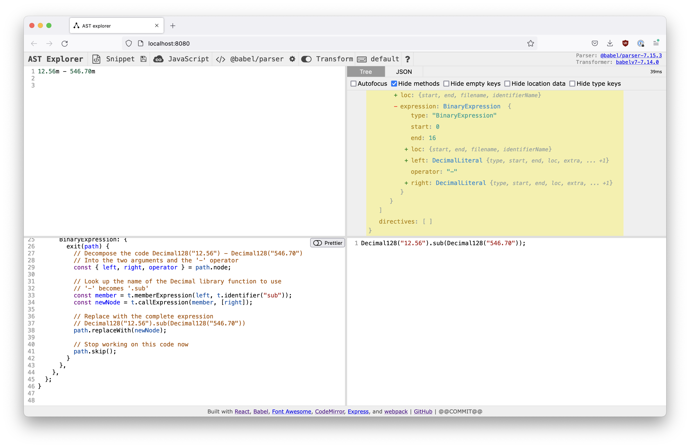
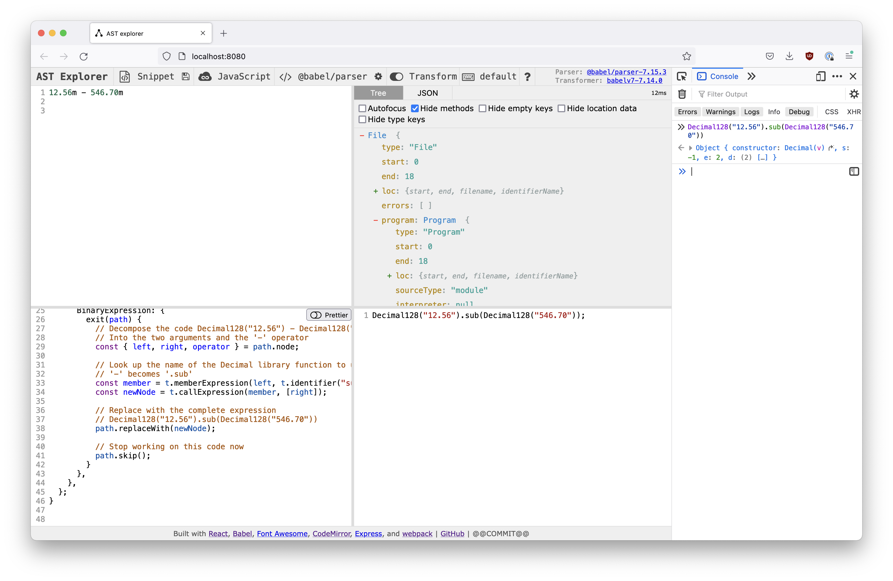

# Building the Decimal Playground 2: On Babel

Once [everything was wired up for the playground app](/decimal-playground-setup), the next step was figuring out how to use [Babel](https://babeljs.io/) to transform Decimal code into runnable contemporary Javascript.

This article covers some of the problems and trade-offs we ran into while implementing the Decimal playground. Since code transforms have different goals and environments — ours did not need to be production-ready but it did need to bottom out into libraries that already existed — all the notes here may not be applicable to your project, but I hope they might give you some good ideas.

We will talk about Babel with a simplified example; discuss tools and documentation to get up and running; look more deeply into the visitor pattern, which underlies the basic structure; touch on creating great errors; and then finish up with a sticky problem. Let's go!

## Babel Basics

Babel is a library that transforms any Javascript into [an abstract syntax tree (AST)](https://medium.com/basecs/leveling-up-ones-parsing-game-with-asts-d7a6fc2400ff), allows us to rewrite that tree, and then outputs the newly transpiled code as tokens (text) again. So for instance, the Decimal subtraction

```js
12.56m - 546.70m
```

becomes

```js
Decimal128("12.56").sub(Decimal128("546.70"));
```

This happens through interventions on the `DecimalLiteral`, a primitive type Babel knows about, and a `BinaryExpression`, which describes the subtraction expression. A very small plugin that did only this could look like this:

```js

export default function (babel) {
  const { types: t } = babel;

  return {
    // These first two name the plugin and update
    // the babel environment for our transformer
    name: "plugin-decimal-128",
    manipulateOptions(opts, parserOpts) {
      parserOpts.plugins.push("decimal");
    },
    // The visitor object lists the functions
    // that will be called when Babel encounters
    // any given type
    visitor: {
      DecimalLiteral(path) {
        // We get the value out of the path argument
        // which represents the original line of code
        const num = t.stringLiteral(path.node.value);
        const callee = t.identifier('Decimal128');

        // We then replave the path with a call to Decimal128:
        // Decimal128("12.56") and Decimal128("546.70"), respectively
        path.replaceWith(t.callExpression(callee, [num]));
      },
      BinaryExpression: {
        exit(path) {
          // Decompose the code Decimal128("12.56") - Decimal128("546.70")
          // Into the two arguments and the '-' operator
          const { left, right, operator } = path.node;

          // Look up the name of the Decimal library function to use
          // '-' becomes '.sub'
          const member = t.memberExpression(left, t.identifier(opToName[operator]));
          const newNode = t.callExpression(member, [right]);

          // Replace with the complete expression
          // Decimal128("12.56").sub(Decimal128("546.70"))
          path.replaceWith(newNode);

          // Stop working on this code now
          path.skip();
        }
      },
    },
  };
}

```

There are a number of articles that cover the basic case in detail, in particular [this great step-by-step transformation guide from Tan Li Hau](https://lihautan.com/step-by-step-guide-for-writing-a-babel-transformation/).

The short version, though, is that Babel iterates over the AST, calling the function defined in `visitor` object each time it encounters a matching type. In our example, the types are `DecimalLiteral` and `BinaryExpression`. The former is the literal representation of the Decimal type, a number followed by `m`: `123.45m`. The latter is any expression with two operands and one operator, such as the arithmetic `+` or `-`, or a comparator, like `>` or `==`.

(This is an OOP pattern called the _visitor pattern_, if you are into things like that.)

Babel provides us with a wrapped representation of the code we are rewriting, the `path`. (The code without the wrapping is the `node` of the tree.) We rewrite this `path` using various convenience construction functions, which can be accessed through the `types` object, often aliased `t`.  In the code above, we use `t.CallExpression` to rewrite the Decimal literal `12.56m` as a call to the underlying library function: `Decimal128("12.56")`.

Simple enough, right? But what about if you want to implement a whole proposal? Where do you start?

## Setup: AST Explorer, Outside Libraries, and `manipulateOptions`

Since working with Babel implies working with the AST of your code, [AST Explorer](https://github.com/fkling/astexplorer) is the first useful tool.



As you might expect from the name, this app takes Javascript input code and decomposes it into its representation as an AST. It also allows one to add rewrite rules and displays the re-written output.

Sometimes, if your rewrite involves a plugin that is not included in the playground as a default — for instance, it is a [Stage 1 proposal](https://tc39.es/process-document/)— your plugin will need to manipulate Babel's options to include its dependencies. In the case of our simple example, we include the decimal parser plugin, which takes care of telling Babel to interpret `12.56m` as a node of the type `DecimalLiteral`.

```js
    manipulateOptions(opts, parserOpts) {
      parserOpts.plugins.push("decimal");
    }
```

In the instance of the Decimal playground, I also wanted to include references to the Decimal and Big libraries. Although AST Explorer does not run the transformed code, by opening the browser console as a "fifth pane" and including the libraries, I was able to test the whole workflow in a single REPL.



This I did by running AST Explorer locally and updating the website template, `website/index.ejs`, to refer to the Decimal libraries using [unpkg](https://www.unpkg.com/).

```html
// ast-explorer/website/index.ejs

<!DOCTYPE html>
<html>
  <head>
    <title>AST explorer</title>
    <meta charset="UTF-8">
    <meta name="description" content="An online AST explorer.">
    <script src="https://unpkg.com/decimal.js@10.3.1/decimal.js"></script>
    <script src="https://unpkg.com/big.js@6.1.1/big.js"></script>
    <%= htmlWebpackPlugin.files.webpackManifest %>
  </head>
  <body>
     <!-- BODY STUFF -->
  </body>
</html>

```

And with that I was ready to start writing!

## How-To: Handbook, Nodes, Builders and the Console

Here, however, I hit a bump. Like many other amazing tools that underpin huge parts of of the modern internet, Babel is great but somewhat under-resourced open source project, which means it can be a little scattered.

For my part, I found it a bit difficult to unearth all the documentation I needed to create Babel plugins, especially since the portion of the library that is used in build tools is more relevant for most site visitors. Eventually, I identified 3 main sources of information to get me from zero to ... normal.

The first was [the tutorial referred to above from Tan Li Hau](https://lihautan.com/step-by-step-guide-for-writing-a-babel-transformation/). This covers the basic end-to-end process in a good amount of detail.

The [Babel Plugin Handbook](https://github.com/jamiebuilds/babel-handbook/blob/master/translations/en/plugin-handbook.md) from Jamie Kyle includes short examples of most plugin builder capabilities as well as tips for writing them. This is a great place to find out if you can do something, but it is not exhaustive. It is best for understanding [transformation options](https://github.com/jamiebuilds/babel-handbook/blob/master/translations/en/plugin-handbook.md#transformation-operations), like inspecting and changing `path`s. (Remember a `path` is a wrapper on a `node` and allows access to introspection and transformation functions.)

Finally, node types and their builders are documented in the [`@babel/types` package API documentation](https://babeljs.io/docs/en/babel-types.html). The biggest complexity here is that because nodes and builders are documented only in terms of their types and without examples, it can take some recursive searching to understand what is necessary to build a node of a particular type. (Do I have a rant about types as documentation? Yes! Is this the place for it? Sadly, no.)

A smaller complexity is you may not be sure what the structure you want to transform into is called. I did not know, before starting, that `tiger.teethNumber()` is a `CallExpression` that includes a `MemberExpression`. (If you are more familiar with [the spec](https://tc39.es/ecma262/#prod-CallExpression), you might!) Luckily, AST Explorer works to help us discover what the structures we want are named as well as it helps us to understand the starting structure. Just type in the end goal and inspect it.

With these three documents and AST Explorer, you should be well set-up to start writing your plugin. Because I like REPL-y flows, I started off writing the basic plugin in the REPL and porting the code back to my repository. Once things became more complicated, I moved to using [`babel-plugin-tester](https://github.com/babel-utils/babel-plugin-tester) and then back to using the playground itself as a REPL for later features.


## Visitor Order and Type Tracking: `enter` and `exit`

One distinction I initially missed in explanations of the Babel visitor object is that the common rendering:

```js
visitor: {
  Type(path) { .. }
}
```

is actually shorthand for

```js
visitor: {
  Type: {
    enter: function(path) { .. }
  }
}
```

which means it is called when the visitor first encounters the node in [its (depth-first) traversal of the AST](https://github.com/jamiebuilds/babel-handbook/blob/master/translations/en/plugin-handbook.md#visitors). As this implies, there is also an operation `exit` that is called when the search exits the node.

In the Decimal playground, this capability is leveraged by transforming the `DecimalLiteral` type on `enter` and at the same time adding the node to a WeakSet of known decimal nodes. Other visitors, such as the `BinaryExpression`, are then called on `exit`. This approach allows us to check whether a given node is a Decimal node before operating on it, even recursively. For instance, the initial implementation of the `BinaryExpression` visitor can use this WeakSet as a performant way to know whether to apply its rewrites:

```js

const replaceWithDecimalExpression = (t, knownDecimalNodes) => (path) => {

  const { left, right, operator } = path.node;

  // if neither node is a known decimal, none of this applies
  if (!knownDecimalNodes.has(left) && !knownDecimalNodes.has(right)) {
    return;
  }

  const newNode = /* rewrite stuff here */;

  knownDecimalNodes.add(newNode);
  path.replaceWith(newNode);
};

```

(You may also notice this function is curried to give it access to variables only available within the main plugin function (`t`, `knownDecimalNodes`). This is because I don't want to define everything within the scope of the Babel function, especially because we have written a plugin for both `Decimal128` and `BigDecimal` modes, and want these to share as much code as possible.)

Altogether, the plugin then calls its visitors on `exit` nearly every time, since knowing whether a component of the expression is a Decimal is vital. The one exception is for `NewExpression`s — the type of the expression `new Blah(arg)`. In this situation, the spec says an error should always be thrown, so the type of `arg` does not matter. Plus, since it is a constructor, we would not expect it to be called with a Decimal.

## Throwing Great Errors: The Code Frame

Checking the `knownDecimalNodes` does not only let us know when to bail out early. It can be used to throw errors when a binary expression is tried with mixed types, counter to the proposed spec.

```js
  if (knownDecimalNodes.has(left) !== knownDecimalNodes.has(right)) {
    throw path.buildCodeFrameError(new SyntaxError('Mixed numeric types are not allowed.'));
  }

```

This code introduces my favorite Babel capability: pretty, informative errors with `buildCodeFrameError`. The output of this error shows us the message and its location in the original user code:

```js

    Mixed numeric types are not allowed.

  1 |
  2 |     
> 3 |     const d = 10.4329m * 11.4329;
    |               ^^^^^^^^^^^^^^^^^^
  4 |
  5 |
```

Putting it all together, we can write the `BinaryExpression` visitor to exit early; throw great errors; and, using construction functions we looked up in the `@babel/types` documentation, replace affected code with calls to the appropriate library:

```js
const replaceWithDecimalExpression = (t, knownDecimalNodes) => (path) => {

  const { left, right, operator } = path.node;

  if (!knownDecimalNodes.has(left) && !knownDecimalNodes.has(right)) {
    return;
  }

  if (knownDecimalNodes.has(left) !== knownDecimalNodes.has(right)) {
    throw path.buildCodeFrameError(new SyntaxError('Mixed numeric types are not allowed.'));
  }

  const member = t.memberExpression(
    left,
    t.identifier(opToName[operator])
  );

  const newNode = t.callExpression(
    member,
    [right]
  );

  knownDecimalNodes.add(newNode);
  path.replaceWith(newNode);
};
```

## Path vs. Node

In this example we can also see usage of both the `path` and `node` representations for a leaf of the AST. As mentioned above, the former wraps the latter with traversal and other utility functions, [documented in the handbook](https://github.com/jamiebuilds/babel-handbook/blob/master/translations/en/plugin-handbook.md#toc-transformation-operations). In particular, the traversal can be used for accessing the `path`s of a given `node`'s subpaths: `path.get(extra.rawValue)` will get the `rawValue` property in a `DecimalLiteral`, as will `path.node.extra.rawValue`.

In the Decimal playground transforms, we switch between the two representations somewhat inconsistently. The `node` representations of values are easy to access using destructuring and it is these representations that are used by the node builder functions, so if a value is not being used for much else, it can make sense to go directly to the `node`. We see this in the `BinaryExpression` example:

```js
const { left, right, operator } = path.node;
```

Likewise, to replace `path`s, one needs access to the `path` itself, and so, if one needs to replace a sub-level segment, one must use `get`. Since validator functions, like `isIdentifier` are available on the `path`, we might think we need the `path` representation for these as well, but we can alternately pass in `t` and access the same functions this way.

```js
const { left } = path.node;
const leftPath = path.get("left");
t.isIdentifier(left) === leftPath.isIdentifier();
```

The tradeoff is being able to use destructuring and not having to dereference the `node` when passing a value to a builder vs. having to pass around the `t` reference. Reasonable people could choose either.

For me, the final bonus of passing `t` around is that when accessing nested properties, the optional chaining operator is usable, whereas using `path.get()` trying to access and undefined property will throw.

```js
path.get(extra.rawValue.tiger.teethNumber) // throws

path.node.extra.rawValue.tiger?.teethNumber) // undefined
```


## On the Complication of Variables: A Return to Errors

The example of the `BinaryExpression` visitor is sadly missing a complex case. (Nothing can ever be easy, can it?)

Remember the tests for making sure the function throws when it is given mixed values like

```js

const d = 10.4329m * 11.4329;

```

look like this

```js
  if (!knownDecimalNodes.has(left) && !knownDecimalNodes.has(right)) {
    return;
  }

	if (knownDecimalNodes.has(left) !== knownDecimalNodes.has(right)) {
    throw path.buildCodeFrameError(new SyntaxError('Mixed numeric types are not allowed.'));
  }


```


But what happens when we start using variables? This will throw even though it should not.

```js
const d = 11.4329m;
d * 10.4329m;
```

If we adjust the test to allow for an `Identifier`, the type of a variable reference, like this:

```js
  if (
    knownDecimalNodes.has(left) !== knownDecimalNodes.has(right) &&
    !(t.isIdentifier(left) || t.isIdentifier(right))
  ) {
    throw path.buildCodeFrameError(new SyntaxError('Mixed numeric types are not allowed.'));
  }
```

then

```js
const d = 11.4329;
d * 10.4329m;
```

would succeed. And we don't want that either. So how do we check for a run-time value in a compile time tool?

The answer is: we have to check at runtime. If you recall, in the [previous article on the general app architecture](/decimal-playground-setup), we have a runner, which is an `iframe` that executes our code, including a patched `console`, which directs console output to the screen.

We can use the index of this `iframe` to also include globally-defined functions (along with the decimal libraries).

```html
<!-- src/runner/index.html -->
<html lang="en">
  <head>
    <meta charset="utf-8" />
    <!-- The libraries we reference -->
    <script src="https://unpkg.com/decimal.js@10.3.1/decimal.js"></script>
    <script src="https://unpkg.com/big.js@6.1.1/big.js"></script>
    <!-- Limited global functions -->
    <script type="module">
      import defineGlobals from "./globals.js";
      defineGlobals(globalThis);
    </script>
    <!-- This is the file that includes user-input code -->
    <script src="./index.js"></script>
  </head>
</html>
```

And within these global functions, which are limited to those that need to be referenced directly from user code at runtime, we have another `BinaryExpression` handler:

```js
// src/runner/globals.js

const isDecInstance = (a) => a instanceof Decimal128 || a instanceof Big;

const binaryExpressionHandler = (left, right, op, message) => {
  const leftIsDecimal = isDecInstance(left);
  const rightIsDecimal = isDecInstance(right);

  if (leftIsDecimal !== rightIsDecimal) {
    throw new TypeError(message);
  }

  if (leftIsDecimal) {
    return left[SINGLE_OPS[op]](right);
  }

  return Function(`return ${left} ${op} ${right}`)();
};
```

This repeats the checks from the Babel transforms once the value is resolved and errors if they do not match.

If the resolved arguments are both Decimals, the corresponding function from either [Decimal.js](https://mikemcl.github.io/decimal.js/) or [Big.js](https://mikemcl.github.io/big.js/) is called. If neither is, the built-in Javascript operation is called using [the `Function` constructor](https://developer.mozilla.org/en-US/docs/Web/JavaScript/Reference/Global_Objects/Function), which works as a somewhat more performant and less-dangerous `eval`.

This runtime code is invoked by wrapping `BinaryExpressions` that include identifiers in a call to `binaryExpressionHandler` within the Babel transforms.

You can see this in process by entering our example code into the Decimal Playground and toggling the output tab.

```js
const d = 11.4329;
d * 10.4329m;
```

becomes

```js
var d = 11.4329;
binaryExpressionHandler(d, Big("10.4329"), "*", "TypeError: Mixed numeric types are not allowed.\n  2 |     \n  3 |     const d = 11.4329;\n> 4 | d * 10.4329m;\n    | ^^^^^^^^^^^^\n  5 |\n  6 |\n  7 |   ");
```

via the `createIdentifierNode` function

```js
// src/transforms/shared.js

export const createIdentifierNode = (t, path, { left, right, operator }) => {
  const { message } = path.buildCodeFrameError(
    new TypeError("Mixed numeric types are not allowed.")
  );

  const newNode = t.callExpression(t.identifier("binaryExpressionHandler"), [
    left,
    right,
    t.StringLiteral(operator),
    t.StringLiteral(message),
  ]);

  path.replaceWith(newNode);
  path.skip();
};
```

One key element to notice in this transformation is the Babel transform creates the error message with `path.buildCodeFrameError` and writes this out to the transformed code, where it becomes an argument to the `binaryExpressionHandler` function. This allows us to preserve and provide robust errors that can point to the line in the original code through the multiple evaluation environments.

You may be asking yourself, why not pass every call to a `BinaryExpression` into the runtime code and let this handler handle every instance, instead of repeating ourselves? That's a good question!

Recall that one of the goals in the previous article was to make the output code legible for users who may want to understand how we are imitating the functioning of a Decimal data-type? The choice to repeat ourselves is a trade-off between making robust errors available everywhere, while also preserving the readability of the output. This way, we only create verbose arguments when we might need them.

That's not the only trade-off we made in the runtime segment of the implementation, though. Let's head out to [chapter 3,  Run Time](/decimal-playground-runtime), to see what else is going on in the `iframe`.
