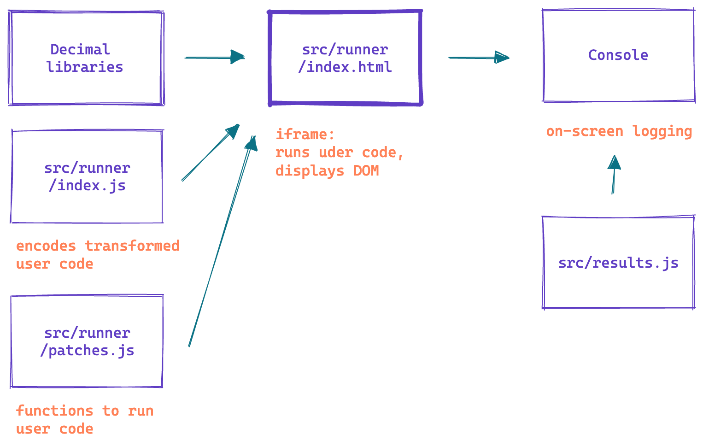

# Building the Decimal Playground 3: Run Time

[Chapter 1, Babel and Proxies and Variables, Oh My!
](/decimal-playground-setup) covered the general goals and approaches for the Decimal Playground project. [Chapter 2, On Babel](/decimal-playground-babel) took us on a journey through the Babel transforms, which allow us to transpile future proposal code into Javascript that is runnable today. This last section covers what we do with the Javascript once we have it.

For functionality not provided by native Javascript methods — namely, manipulations involving the Decimals as numerical values — we use the [Big.js](http://mikemcl.github.io/big.js/) and [Decimal.js](https://mikemcl.github.io/decimal.js/) libraries.
The first is used in `BigDecimal` mode and represents the values with unlimited precision. The second gives us 34 digits of precision, to mimic a `Decimal128` approach. ([See the proposal for more distinctions between the two.](https://github.com/tc39/proposal-decimal))

Internal code needed to interface between the libraries and user code; to interface between Javascript built-ins and user code; or to provide what neither does is runtime code, and its structure is covered in this last chapter.

## Plumbing

For the playground to feel like a complete experience, we want to run the code from the editor and show its results in the on-screen console and the DOM pane, if applicable.  

This is found in the [`src/runner/` directory of the playground code](https://github.com/sarahghp/decimal-playground/tree/main/src/runner), with the business end of running the code in [runner/index.js](https://github.com/sarahghp/decimal-playground/blob/main/src/runner/index.js). Here the transformed code is encoded as a base-64 data URI and imported into the `iframe` context defined in [runner/index.html](https://github.com/sarahghp/decimal-playground/blob/main/src/runner/index.html), which is what is displayed in the DOM pane. (The patched console is defined outside `src/runner/` in `src/results.js`, but it mostly just amalgamates the console content and renders it using `react-inspector`. This makes objects inspectable instead of printing them as strings.)



## Interpreting: The Three Interventions

The rest of the [`src/runner/` directory](https://github.com/sarahghp/decimal-playground/tree/main/src/runner) contains the code that implements our simulation of Decimal. Rather than being an edge-case-tested, contained production polyfill, the code here is a hodgepodge whose aim is to implement the required functionality in the lightest possible way. As the proposal advances, the requirements will morph; when one proposed branch — `BigDecimal` or `Decimal128`— is selected, then chunks pertaining to the other will be deleted.

For now, three types of intervention to mimic the proposal are used: operator-based wrapped functions; our own functions; and proxies. The second two are instantiated in `src/runner/patches.js`; the first is in `src/runner/globals.js`.

It is where we left off in Part 2, and so we will start with it first.

## Intervention 1: Wrapped Functions

Wrapped functions are the approach used for functions created to add extra context in transpiled code. The example we saw for this in Part 2 was [when we took care of binary expressions with unresolved variables using the `binaryExpressionHandler`](). This function passed along the pretty errors from Babel into the runtime, so that mistakes identified here could still benefit from clear traces.

In general, most functions in this approach apply to similar cases: they mirror checks and coercions present in the transform code for situations where a variable is used, so it can be resolved in the runtime. This includes binary and unary expressions and `Decimal` constructor coercions:

```js
const a = 363.4m;

// binary expressions
a * 100.m;
a >= 443.2m;

// unary expressions
typeof a;
-a;

// constructor coercion

const b = 123n;
Decimal(b);

```

The constructor coercion is required because our proposed rules vary slightly from the behavior embodied in the libraries — for instance we propose that a Decimal can be constructed from a `Boolean`, whereas `Big.js` throws. While we could create a Proxy, as we will see in a later section, the library constructors are hairy enough that intervening before the argument is passed saves us from needing to know too much about a library's internals.

Another interesting case for our wrapped functions is the need to intervene in conditional test conditions. Since the `DecimalLiteral` is always rendered as an instance from the relevant Decimal library, it is an object, which means, left alone, it will always convert to `true`, even when it represents `0m`.

So for something like:

```js
let a = 0m;

if (a) {
  console.log('so true')
} else {
  console.log('so false')
}
```

the output is rendered as

```js
if (wrappedConditionalTest(a)) {
  console.log('so true');
} else {
  console.log('so false');
}
```

and then `wrappedConditionalTest` uses the `Number` constructor to get the value out of the object:

```js
const wrappedConditionalTest = (a) => {
  if (isDecInstance(a)) {
    return Number(a);
  }

  return a;
};
```

(This works because the libraries define a `valueOf` method.)

Finally, there is one exception to the rule that this approach deals with variable shadows, but it does match the need for the wrapped conditional test — the instantiation of the Decimal as an object. This exception is `log`, which can be used as a shorthand for `console.log` and renders the value of the Decimal instead of the object.

```js

const d = 10.4329m + 11.4329m;
log("a decimal:", d); // ↪️ "a decimal: 21.8658"(2)
console.log("internals:", d); // ↪️ ["internals:", Big]
```

***

One last note about this structure: because these functions are called directly from the transpiled code and don't belong to another globally defined object, they are themselves defined globally. Because global variables can get messy quickly, we have limited `src/runner/globals.js` to functions that absolutely must be global. To discourage new additions from taking the global shortcut, we instantiate them with a top-level import passing the `globalThis` in `runner/index.html`:

```html
    <script type="module">
      import defineGlobals from "./globals.js";
      defineGlobals(globalThis);
    </script>
```

This means they must be added to the global file and cannot be distributed across the codebase.

## Intervention 2: Our Own Decimal Functions

The next approach is a set of functions that are not added globally, but rather added to the `Decimal` object. These are also called from the compiled code, but occupy a somewhat different space from the identifier wrappers and handlers in the previous section. Rather than being interventions into the language side of the project, they are instead functions that could plausibly belong to the `Decimal` constructor but are not part of the user-facing API in this form.

For instance, we add `Decimal.addOrConcat`, which fulfills the proposed specification that when called with a string, the `+` operator concatenates the values.

```
log(10m + "a") // "10a"
```


By rendering this as

```
log(Decimal.addOrConcat(Big("10"), "a", /* Error text */));
```

we communicate some of the assumptions of the proposal to any users looking at the output pane. While this might not be blockbuster functionality, it is a type of finish that is worth the small complications it might add to the codebase.

This group also includes functions that do not have a clear relative in the Decimal libraries. For instance, neither contains a strict equals equivalent to the Javascript `===` operator, which is intended to check both type and value. (Since the internal representation of a Decimal in a library has to be a string or entries on an object — the reason a new data type is being proposed — we can neither check the type correctly nor can we use the built-in operator.)

Without a built-in to proxy, operations like `tripleEquals` and `notTripleEquals` are added wholesale to the `Decimal` object.

What does "without a built-in to proxy" mean exactly? Well, let's take a look at our largest group of interventions — the Proxy-based — and find out.

## Intervention 3: Proxies

Learning more about Javascript's Proxy was one of the highlights of this project for me — second only to really getting to dig in to Babel plugins, perhaps.

Added with ES6, a Proxy is an object that wraps another object and allows for metaprogramming — interventions into user-called code in a programmatic way. A Proxy is constructed with two arguments: a `target`  and a `handler`. The former is the object we are wrapping — anything from a literal like `{first: 1}` to a complex module. The latter is an object that defines functions for the proxy traps: the actions that users can take on the target.

So, for instance, the simplest Proxy we can think of might be an intervention to print the name of a field being accessed.

```js
const basic = {
  first: 1
};

const printHandler = {
  // called when we access a property
  get(target, prop){
    console.log(`${prop}!!`);
    return target[prop];
  }
}

const printy = new Proxy(basic, printHandler);
printy.first // ↪️ logs 'first!!' and returns 1
```

This uses the `get` trap which is [triggered when an object property is accessed via `.`, `[]`, `Reflect.get`, or inheritance](https://developer.mozilla.org/en-US/docs/Web/JavaScript/Reference/Global_Objects/Proxy/Proxy/get).

Remember, though, in Javascript a function is just a callable object. That means proxies can be used to wrap functions and, through the `apply` trap, intervene when the function is called.

(To learn about all the traps available in a `Proxy` handler, I cannot recommend anything better than [the _Looking at All 13 JavaScript Proxy Traps_ tutorial](https://www.digitalocean.com/community/tutorials/js-proxy-traps) from Digital Ocean. To dive deeper into the details of the Proxy, [the ExploringJS chapter on proxies ](https://exploringjs.com/es6/ch_proxies.html#sec_proxies-explained) is thorough and detailed.)

It is this functionality that forms the core of of our not-a-polyfill runtime code. It includes [`Map` and `Set` functionality](https://github.com/tc39/proposal-decimal/blob/master/bigdecimal-reference.md#bigdecimal-as-key-for-mapset) and prototype methods like [`toFixed`, `toPrecision` and `toExponential`](https://github.com/tc39/proposal-decimal/blob/master/bigdecimal-reference.md#bigdecimalprototypetofixeddigits). For these, the proxy handlers intervene to adjust or rearrange values before calling the `target` functions.

For example, when getting and setting values in a `Map`, a Decimal value should be distinguishable from the same value rendered as a string or number. It cannot however rely on object-based representations because _any_ equivalent Decimal value must be indistinguishable.

```js
let decimal = 3.55m;

// Map
let m = new Map();

m.set(decimal, "test");
m.get(3.55m); // ↪️ "test"
m.get(3.55); // ↪️ undefined
m.get("3.55"); // ↪️ undefined
```

To implement this, we reassign `Map.prototype.set` and `Map.prototype.get` to proxies

```js
// src/runner/patches.js
Map.prototype.set = new Proxy(
  Map.prototype.set,
  createPrototypeHandler(decToStringMap)
);

Map.prototype.get = new Proxy(
  Map.prototype.get,
  createPrototypeHandler(decToStringMap)
);
```

and these proxies create identifiable strings, which give us the referential transparency of a string and the distinguishability of a Decimal

```js
// src/runner/patch-prototype.js

export const decToStringMap = (target, thisArg, [key, val]) => {
  const isDecInstance = (a) => a instanceof Decimal128 || a instanceof Big;

  const convertedKey = isDecInstance(key) ? `${key.toString()}m` : key;
  return target.call(thisArg, convertedKey, val);
};
```

We also use proxies to create polymorphic `Math` functions, an approach currently discussed as part of [the BigInt Math proposal](https://github.com/tc39/proposal-bigint-math), but added to the playground to discover whether the functions are expected, used, or otherwise commented on.

We started with a few options to support examples we discovered — `abs`, `floor`, `log10` and `pow` — although I would love to see it extended to workhorses like `max` and `min`. These follow the pattern of `Map`, but their handlers distinguish action based on type and then route Decimal versions to the appropriate Decimal library.

```js
// src/runner/patch-util.js

const createUnaryHandler = (substituteFns) => ({
  apply(target, thisArg, argsList) {
    const [arg] = argsList;
    if (arg instanceof Decimal128) {
      return substituteFns[DECIMAL_128](...argsList);
    }

    if (arg instanceof Big) {
      return substituteFns[BIG_DECIMAL](...argsList);
    }

    return target.apply(thisArg, argsList);
  },
});

// src/runner/patch-math.js
const absImpl = {
  [DECIMAL_128]: Decimal.abs.bind(Decimal),
  [BIG_DECIMAL]: (arg) => arg.abs(),
};

// simplified application
Math.abs = new Proxy(Math.abs, createUnaryHandler(absImpl));
```

The final group of proxies contains methods on the `Decimal` constructor that, unlike those in the Our Own Decimal Functions category, are expected to be called from user code: `Decimal.divide` or `Decimal.round`, for instance.

While these could be directly added to the constructor as above, this method allows us to re-use the sorting between different Decimal versions in the `createUnaryHandler` factory. Even better, it lets us handle the non-Decimal case elegantly, by making the `target`, to which we fall though, a function that throws the non-Decimal error:

```js
Decimal.round = new Proxy(
  decimalOnlyBaseFn("Decimal.round"),
  createUnaryHandler(roundImpl)
);
```

This could be further improved by using the Babel transforms to add the error frame, and probably should be.

## One Question: Proxies and Patches

One big question asked of me as we started working on this project was _Why use proxies instead of more direct moneypatching?_

That is why do

```js
Math.abs = new Proxy(Math.abs, createUnaryHandler(absImpl));
```

instead of something like

```js
const _abs = Math.abs;

Math.abs = (arg) => {
   if (instanceof Decimal) {
     /* Do Decimal things */
   } else {
     _abs(arg);
   }   
};
```

And I think that's a very fair question with an answer that's mostly aesthetics and ways to encourage people to take good structural steps when adding code.

Not needing to manually track a reference to the original function, but instead letting the language do it for us is a bit cleaner, in my opinion, and creating the handlers encourages further additions to reuse the same code. I love that the list of all the reassignments we are making is the majority of `src/runner/patches.js`, and the file is thereby a clear list of what is being changed with the library.

(This is not the case with the `Math` patches, which are iterated in their own file, and I think this is a mistake, although we do gain a small consistency check.)

Proxies do have a performance cost, though, and should you decide to explore your language ideas in a playground, you may decide this the other way. And that would be rad too.

## One More Chapter

Phew, that was a long adventure. Thanks for sticking by me! Maybe you have forgotten all the places we've been. If so, join me in [the last chapter](/decimal-playground-wrap-up), a small wrap-up of the lessons we learned along the way.
