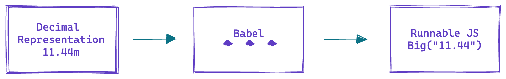
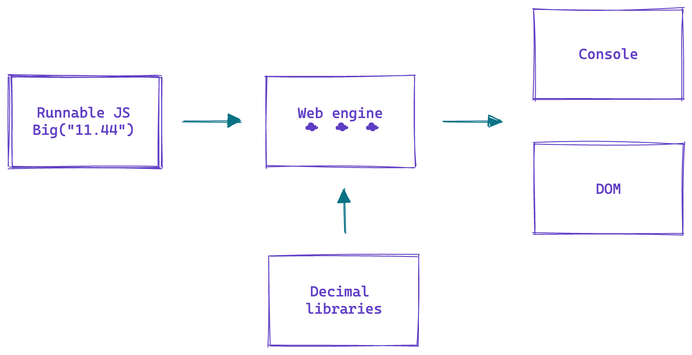
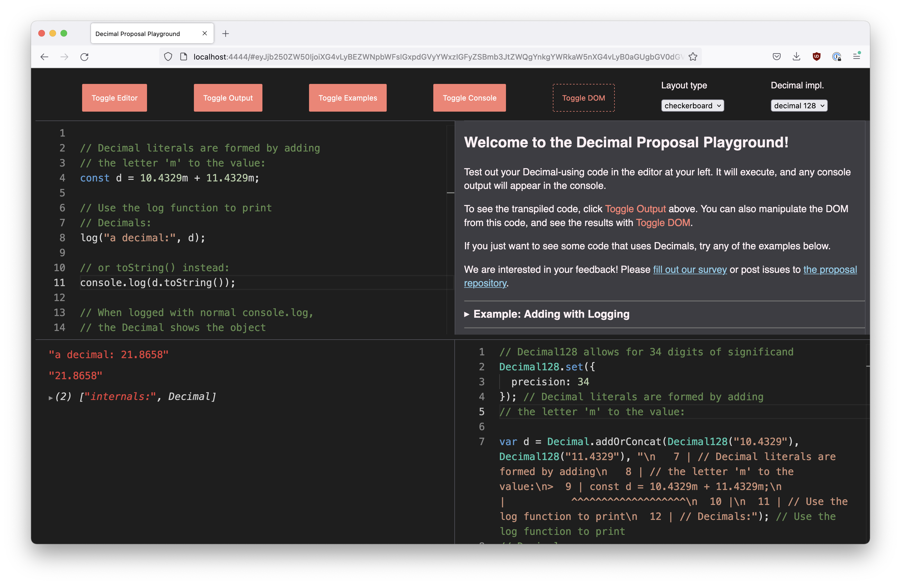

# Building the Decimal Playground 1: Babel and Proxies and Variables, Oh My!

## Introduction

On and off for the past 8 months or so, with the help of a few other Igalia engineers, I have built up my first Javascript language playground. The purpose of the project is to help visitors experience what it would be like to use the [proposed Javascript Decimal datatype](https://github.com/tc39/proposal-decimal). This series isn't about the proposal however — you can read more about it in [the playground introduction](/decimal-playground-intro.md). Instead, it's about the secret, secondary purpose of the project: learning about using Babel, Proxies, and other fun elements of the broader Javascript landscape.

This first chapter will talk about some code goals and the general architecture of the app. The second chapter, [On Babel](/decimal-playground-babel) covers Babel and if that is more interesting to you than the details of the app architecture, please feel free to eject to it now. Then the third, [Run Time](/decimal-playground-runtime), covers more about the not-a-polyfill implementation.

This is more a short narrative than a real tutorial, but I hope it gets you excited all the same.

## Project structure I: How Hypothetical Code Becomes Runnable

When beginning the project, the first thing I needed to wrap my head around was what the playground app needed to do at a high level. Because it needs to represent values that don't currently exist in Javascript, like the Decimal literal — `1.3456m` — the app needs to transform input text into Javascript that a web engine can execute.



Users will also want to be able to see the results of running this code, which means we need to execute it and render the output. Luckily, since this is a web app, we have the execution context right there: the browser engine.



This is supported by using libraries that have implemented functionality similar to the two modes we are exploring: [Big.js](http://mikemcl.github.io/big.js/) for the BigDecimal option and [Decimal.js](https://mikemcl.github.io/decimal.js/) for the Decimal128 option.

## Code Goals: Expected Context

Figuring out what not to build and where to focus energy when creating an app can be difficult. To help keep my focus where it needs to be — because I am happy to refine forever — it was important to list out what I expected the usage context and goals for the app would be.

The playground occupies a strange zone in between a proof-of-concept and a production application. It won't last forever and only a few engineers might work on it, but it's more than a flash in the pan and it needs to be able to evolve along with the proposal. So whatever patterns we choose shouldn't be _too_ hard to change; at the same time, focusing too much on performance and production hardening wouldn't be the best use of our time.

Currently, there are two competing implementation options for the proposal as well — Decimal128 and BigDecimal. These vary in how they represent Decimal values and the concomitant limitations. The playground therefore needs to make it possible to compare and contrast both versions and then support the chosen option. That means the project structure needs to support dual implementations — in a way that makes it as easy as possible to rip out the disfavored one, once we get to that step.

I also expect that some users want to read the translated Javascript code to understand what the proposal is actually doing. In parallel, as above, users who prefer to understand via demonstration will want to see the output in console or DOM.

Because understanding the proposal and the code it facilitates means understanding what it also does not facilitate, errors should be clear and helpful. The code should also communicate the stability of its API, which is currently very unstable. To that end, the execution context code — that is, the code into which our Decimal code is transformed — is not a production-style polyfill: it's not a small package of well-proofed code, because we aren't there yet. Because we aren't there yet, there should be no chance of someone using this execution code in their own work.

Finally, I hope users will want to share their code with other people, widening awareness and increasing our feedback.


## Project structure II: The Actual App



Given the general setup — transpilation and execution — and the goals we've outlined, we can turn towards the actual setup of the project. There are three main sections: `transforms`, `src`, and `src/runner`. `transforms` includes the Babel transformation code, which is covered in [the second part](/decimal-playground-babel).  `src` contains the React app, which, in addition to providing the UI, serves to route user-written code between the primary editor; the transpiled code display (a read-only editor instance); and the execution context, represented in `src/runner`.

The editor is Monaco; in hindsight, a mixed choice. As I started the project using the [Records & Tuples playground](https://rickbutton.github.io/record-tuple-playground) as a template, I went with the general blueprint already there, which included Monaco. (The right choice, given time tradeoffs.) However, the deep dedication to an object-oriented API feels somewhat against the grain of declarative frameworks, something I also noticed the last time I used Monaco.

In addition, the pros of Monaco — a robust built-in linter and autocomplete — can be mixed blessing with new syntax proposals, as it leads to spurious errors. The fairly thin documentation and inability to decouple basic autocomplete from more complex functionality means that even discovering how to silence certain errors took research into non-official docs. The method then involves listing errors to ignore one-by-one:

```js
monaco.languages.typescript.javascriptDefaults.setDiagnosticsOptions({
  diagnosticCodesToIgnore: [1005, 1351, 7027],
});

```

If I were doing this again, I might look into using [Code Mirror](https://codemirror.net/) instead.

Regardless, once we have the code entered and transpiled, we need to execute it. But how to do so [without using `eval`](https://developer.mozilla.org/en-US/docs/Web/JavaScript/Reference/Global_Objects/eval#never_use_eval)? Here the inspiration of Records & Tuples was instructive.

By creating an `iframe`

```html
<!DOCTYPE html>

<html lang="en">
  <head>
    <meta charset="utf-8" />
    <script src="./index.js"></script>
  </head>
</html>
```  

with a script that converts the user code to a base-64 string that is then imported:

```js
globalThis.run = function (source, console) {
  globalThis.console = console;

  const encodedJs = btoa(source);

  const dataUri = "data:text/javascript;base64," + encodedJs;
  return import(/*webpackIgnore: true*/ dataUri).catch((err) => {
    console.error(err.message);
    console.error(err.stack);
  });
};
```

we can call `run` each time the user code updates and it will be executed in the `iframe` context.

This code also shows that the default window console is being replaced by a custom `console`. This function routes the console output away from the browser and into the console window within the app, so that logs and errors are elevated to sit beside the code. It also facilitates some interventions into different log and error rendering; where the former uses `react-inspector` for its object rendering, the latter uses another read-only instance of Monaco, so that the code highlighting in errors matches the original code.

It is important to be sure we are catching and logging errors in the execution call, so that all errors are routed to the onscreen box.

```js
globalThis.run = function (source, console) {
  globalThis.console = console;

  const encodedJs = btoa(source);

  const dataUri = "data:text/javascript;base64," + encodedJs;
  return import(/*webpackIgnore: true*/ dataUri).catch((err) => {
    console.error(err.message); // HIGHLIGHT HERE
    console.error(err.stack);
  });
};
```

Finally, to facilitate sharing without maintaining a backend, the window hash base-64 encodes the state of the application and the text currently in the editor. The downside to this approach is that the links can be kinda gnarly and worse, the app [errors when you use emoji 😭](https://developer.mozilla.org/en-US/docs/Web/API/btoa#unicode_strings).

The hash also encodes the toggle state of each window. That means that when sharing examples, you can be sure the correct elements are viewable.

---

And that's how all the knobs and tubes are wired up. [To learn some cool stuff about Babel, go on to the second article](/decimal-playground-babel).
